# IMC401 Quick Notes

**DISCLAIMER:** ***This content is not marketed to be fully complete, this is concise revision notes. Expect contents to be shorten or removed from the original notes. You have been warned.***

***Thanks to these contributors that helped in the making of the note:** Haziq (CDIM1C), Syazdwan (CDIM1B), Sufian (CDIM1B), Danish (CDIM1B), Afiq (CDIM1B), Haizi [Myself] (CDIM1C)*

# CHAPTER 1 Introduction to ICT

|ITEM|DESCRIPTION|
|-|-|
What is ICT? | ICT is the technology required for information processing, in particular, the use of electronic computers, communication devices and software applications to convert, store, protect, process, transmit and retrieve information from anywhere, anytime.
Information|***The knowledge obtained from reading, investigation, study or research.*** The tools to transmit information are the telephone, television and radio. We need information to make decisions and to predict the future.
Communication|***Communication is an act of transmitting messages.*** It is a process whereby information is exchanged between individuals using symbols, signs or verbal interactions. Communication is important in order to gain knowledge.
What is Digital Literacy? | ***It is the ability to understand and use information in multiple formats from a wide range of sources when it is presented via computers.*** It involves any number of digital reading and writing techniques across multiple media forms, including words, texts, visual displays, motion graphics, audio, video, and multimodal forms.
Categories of Digital Literacy (*Spires and Bartlett, 2012*) | <ol><li>**Locating and Consuming Digital Content:** There is consensus that effective Web search skills must be developed for a digital society, and instruments checklist being developed to ensure that they have the necessary prerequisite Web search skills </li></li><li> **Creating Content:** The implementation of digital content may be an important and effective method to embrace the 21st century skills that are expected to master. <li> **Communicating Digital Content:** Web 2.0 tools are social, participatory, collaborative, easy to use, and facilitate the creation of online communities which enable to communicate digital content using mobile devices such as cellphones and tablets that provides convenience and immediacy to the communication process for everyone.
What is computer? | A computer is an electronic device, operating under the control of instructions stored in its own memory.
Advantages of Using Computer| <ol><li>**Speed:** data, instructions, and information flow along electronic circuits in a computer at incredibly fast speeds.<li>**Reliability:** dependable and reliable because they rarely break or fail.<li>**Consistency:** produce the same results — consistently, generate error-free results<li>**Storage:** store enormous amounts of data and make this data available for processing anytime it is needed.<Li>**Communication:** computers can communicate with other computers, often wirelessly, and allow users to communicate with one another.
Disadvantages of Using Computer| <ol><li> Violation of privacy<li>Public safety<li>Impact on labour force<li>Impact on environment</li>*Health risks:* <li>Carpal<Li>tunnel syndromes<li>Vision problems<li>Backache<li>Headache
Computer Users | **Home user:** Spends time on the computer for personal and business, communication, personal financial management and web access. **Home Office:** User includes any company with fewer that 50 employees, as well as self-employed people that work out of their home. Mobile user: Travel to and from a main office or school to conduct business, communicate, or do homework. **Power user:** Such as an engineer, architect, or dekstop publisher--typically work with multimedia, and requires the capabilities of a workstation or other powerful computer. **Large business user:** Works for a company that has a large number of employess and computers usually connected to a network.
Computer application in society | <ol><li>Education<li> Government <li> Finance <li> Retail <li> Entertainment <li> Health Care <li> Science <li> Travel<li> Publishing <li> Manufacturing
**1** Education| <li> Computers are excellent tools for helping students learn specific skills, such as how to properly research online, create online content, and use digital tools for collaboration. <li> Computers can also be used to provide students with real-world experience that helps them to explore and apply their skills.
**1** Uses of computer in education | <ol><li>Enhancing Student Engagement<li>Improving Access to Information<li>Facilitating Collaboration<li>Personalizing the Learning Experience<li>Developing Digital Literacy<li>Enhancing Productivity and Efficiency<li>Utilizing Educational Software<li>Technology Tools for Teaching and Learning.
**2** Government |  Computers play an important roles in government. Some major fields in this category are: <li> Budgets <li> Sales tax department<li>income tax department<li> Male/Female ratio<Li>Computerization of voters lists<li>Computerization of driving licensing system<li>Weather forecasting
**3** Finance | <li>Computer is now mostly used in offices as one of the equipment in financial institutions and this computer performs many functions apart from calculating function. <li> It also performs different functions as data analysis, prediction, the identification of trend and even the creation of new approaches and ideas.
**4** Retail | <li>Computers can be used to buy and sell products online. This enables sellers to reach a wider market with low overheads, and buyers to compare prices, read reviews, and choose delivery preferences. <li> It offers a global address and makes it easy for both businesses and customers to deal with each other.
**5** Entertainment | <li> Computers are also playing very important role for the entertainment of human beings<li> Nowadays, computer can be used to watch television programs on the Internet<li>People can also watch movies, listen music, and play games on the computer.<li> Many computer games and other entertainment materials of different kinds are available on the Internet.
**6** Healthcare | Every area of the medical field uses computers such as laboratories, research offices, scanning, monitoring, pharmacy etc. which are helping the doctors to diagnose diseases and many other purposes 
**6** Example of healthcare | <li> Maintain patient history and other records<li> ICU (Intensive Care Unit)<li>Operation Theater<li>Recovery Room<li>Medical Ward<li>ECG<li>Diagnosis of Diseases<li>Telemedicine<li> Computer-aided surgery.
**7** Science| <li>Science for research and development<li>The computers have played a major role in most of what we know about ourselves and the universe<li>The satellites, the telescope and almost all research tool make use of computers in some or the other way.<li>The huge calculations required for space science, safe communication between scientist, storage of all gathered information are some of the computers uses in science and technology.
**8** Travel | <li> Online travel agencies such as expedia.com, are a large contribution to how the travel and tourism industries have changed due to technology.<li>These online agencies help users plan and book trips and provide comparisons of hotels, flights, vacation packages, prices and more, all in one place.
**9** Publishing | <li> Publishers use computers to design and produce hard-copy books and e-books, market books to readers and track sales. Readers download books and magazines to their phones, laptops and tablets to read wherever they go. <li> Reporters use the Internet to gather research<li>Many newspaper produce Web versions<li> Textbook was produced entirely on computer workstation<li> **Desktop publishing** is the production of printed matter by means of a printer linked to a desktop computer, with special software.<li>The system enables reports, advertising matter, etc., to be produced cheaply with a layout and print quality similar to that of typeset books.<li>For example, desktop publishing is utilized to create printed material, such as book covers, brochures, catalogs, flyers, magazines, and posters.
**10** Manufacturing | *Two groups:*<li>Computer monitoring and control of the manufacturing process. <li>Manufacturing support applications, which deal essentially with the preparations for actual manufacturing and post-manufacture operations</li>**Embedded computers** are extensively used in many manufacturing applications, especially for the control of production processes.

# CHAPTER 2 Components of computer hardware

|ITEM|DESCRIPTION|
|-|-|
Input | Any data and instructions entered into the memory of a computer
Input device | The hardware used to enter the data and instruction
Commonly used input methods| <li>Keyboard<li>Pointing Devices<li>Touch Screens<li>pen input<li>motion input<li>voice input<li>video input<li>scanners and reading devices.
Keyboard | An input device that contains keys you press to enter data and instructions into a computer or mobile device.
Keyboards have... | <li>Typing area<li>Function keys<li>Toggle keys<li>Navigation keys<li>Media control buttons<li>Internet control buttons<li>and Other special keys
Keyboard options | <li> Built-in laptop keyboard<li>Clip-on tablet keyboard<li>and On-screen keyboards.
Ergonomic keyboard design | Has a design that reduces the chance of repetitive strain injuries (RSIs) of wrist and hand.
Ergonomics incorporates... | comfort, efficiency, and safety in the design of the workplace.
Pointing device | The device that allow user to control the pointer or cursor on the screen.
Pointer | is a small symbol on the screen whose location and shape change as a user moves a pointing device.
Mouse| Is a pointing device that fits under the palm of your hand comfortably.
Mouse example | <li>Optical mouse<li>laser mouse<li>touch mouse<li>Mechanical mouse.
Touchpad | Small, flat, rectangular pointing device that is sensitive to pressure and motion.
Trackball |Stationary pointing device with a ball on its top or side.
Touch screen |Touch-sensitive display.
Pen input methodology| You touch a stylus or digital pen on a flat surface to write, draw, or make selections.
A graphics tablet (digitizer)|Electronic plastic board that detects and converts movements of a style or digital pen into signals that are sent to the computer.
Voice input |A process of entering input by speaking into a microphone.
Audio input |A process of entering any sound into the computer such as speech, music, and sound effects.
Video input |A process of capturing full-motion images and storing them on a computer or mobile device’s storage medium.
A webcam | A type of DV camera that enables a user to <li>Capture video and still images<li>Send email messages with video attachments<li>Broadcast live images or video over the Internet<li>Conduct video conferences<li>Make video calls.
Scanner | A light-sensing input device that reads printed text and graphics and then translates the results into a form the computer can process.
Types of scanners and reading devices| Flatbed scanner<li> Hand-held scanner<li> Sheet-fed scanner<li> Drum Scanner.
Optical reader | A device that uses a light source to read characters, marks, and codes and then converts them into digital data that a computer can process.
Optical reader example | <li>Optical character recognition (OCR)<li> Optical mark recognition (OMR)
Bar code reader/scanner methodology| Uses laser beams to read bar codes.
QR code methodology| Stores information in both a vertical and horizontal direction.
RFID (radio frequency identification)| Uses radio signals to communicate with a tag placed in or attached to an object.
RFID reader methodology| reads information on the tag via radio waves. 
RFID capabilities| <li>Can track times of runners in a marathon<li> Tracking location of people and other items<li> Checking lift tickets of skiers<li> Gauging temperature and pressure of tires on a vehicle<li> Checking out library books<li> Managing purchases<li> and Tracking payment as vehicles pass through booths on toll-way systems.
Magnetic-stripe readers methodology| Read the magnetic stripe on the back of cards such as <li>Credit cards<li> Entertainment cards<li> Bank cards<li> Identification cards<li> Other similar cards.
MICR (magnetic ink character recognition) devices| Read text printed with magnetized ink.
MICR reader methodology | Converts MICR characters into a form the computer can process.
MICR use case | Banking industry uses MICR for check processing. A data collection device obtains data directly at the location where the transaction or event takes place.
Case / Chassis | Contains and protects the electronics of the computer or mobile device from damage
What's inside desktop case? | <li>Sound card<li> Power supply and fan<li> Hard disk<li> Processor<li> Heat sink and fan<li> Memory module.
What's inside laptop case?| <li>Battery<li> Integrated sound ports and circuitry<li> Processor<li> Heat sink and fan<li> Memory module.
Motherboard | Is the main circuit board of the computer.
Motherboard contains | <li>Slots for memory modules<li> Slot for processor chips<li> CMOS battery<li> Ports to connect peripheral devices<li> Slots for adapter card.
Computer chip | Is a small piece of semiconducting material, usually silicon, on which integrated circuits are etched.
Processor / CPU methodology | Interprets and carries out the basic instructions that operate a computer.
Multi-core processor | Is a single chip with two or more separate processor cores.
Processors contain | <li>Control unit (CU) <li> arithmetic logic unit (ALU)
Control unit (CU) | Is the component of the processor that directs and coordinates most of the operations in the computer.
Arithmetic logic unit (ALU) | Performs arithmetic, comparison, and other operations.
Processor methodology|For every instruction, a processor repeats a set of four basic operations, which comprise a **machine cycle**.
Steps in machine cycle | 
Registers| Temporarily hold data and instructions.
System clock| Controls the timing of all computer operations.
Pace of the system clock is called | the **clock speed**, measured in gigahertz (GHz)
Manufacturers of processor chips | **Intel** and **AMD**
Processor chip downsides | It generates heat that could cause the chip to malfunction or fail. Therefore it require additional cooling like Heat sinks, Liquid cooling technology, or Cooling pads.
Memory definition | Consists of electronic components that store instructions waiting to be executed by the processor, data needed by those instructions, and the results of processing the data.
Memory stores... | <li>The operating system and other programs<li> Applications<li> Data being processed and the resulting information.
Memory methodology | Each byte resides temporarily in a location in memory that has an address.
Memory size units measurements | Gigabytes (GB)
Two kinds of memory| **Volatile memory:** Loses its contents when power is turned off. E.g.: RAM **Non volatile memory:** Does not lose contents when power is removed. E.g.: ROM, flash memory, and CMOS.
Types of RAM | <li>Dynamic RAM (DRAM)<li> Static RAM (SRAM)
RAM chips | Usually reside on a memory module and are inserted into memory slots.
Memory cache | Speeds the processes of the computer because it stores frequently used instructions and data.  
Read-only memory (ROM) | Memory chips storing permanent data and instructions.
ROM example | Firmware
Flash memory method | Can be erased electronically and rewritten.
CMOS | Uses battery power to retain information when the power to the computer is off.
Access time | The amount of time it takes the processor to read from memory.
Access time measurement | Nanoseconds
Adapter card function | enhances functions of a component of a desktop or server system unit and/or provides connections to peripheral devices.
Adapter card example| <li>Sound card <li>video card.
Expansion slot | A socket on a desktop or server motherboard that can hold an adapter card.
Plug and Play technology| the computer automatically can recognize peripheral devices as you install them.
USB adapter | enhances functions of a mobile computer and/or provides connections to peripheral devices.
Bus | allows the various devices both inside and attached to the system unit to communicate with one another.
Example of buses | <li>Data bus<li> Address bus.
Word size | The number of bits the processor can interpret and execute at a given time.
A computer might have these three types of buses | **System bus:** Connect processor to main memory (RAM). **Backside bus:** Connect processor to memory cache. **Expansion bus:** Connect processor to peripherals.
Power supply / laptop AC adapter function | Converts the wall outlet AC power into DC power. Mobile computers and devices can run using either a power supply or batteries.
Batteries composition | Rechargeable lithium-ion batteries.
Output | Is data that has been processed into a useful form.
Output device | the hardware component that conveys information to the user.
Display | visually conveys text, graphics, and video information.
Monitor | A display that is packaged as a separate peripheral device like Liquid Crystal Display (LCD), Light Emitting Diodes (LED), Cathode Ray Tube (CRT), Plasma.
Display specs | Resolution<li> Response time<li> Brightness<li> Dot pitch<li> Contrast ratio.
Monitors zaman now | use a digital signal to produce a picture.
Monitor ports | <li>Digital video interface (DVI) port<li> High definition media interface (HDMI) port<li> or A Display Port.
Home users | Use a **digital television (DTV)** as a display. **HDTV** is the most advanced form of digital television. A **Smart TV** is an Internet-enabled HDTV
Data projector | A device that projects the text and images displaying on a computer or mobile device screen on a larger screen so that an audience can see the image clearly.
Interactive whiteboard | A touch-sensitive device, resembling a dry-erase board, that displays the image on a connected computer screen.
Printer define | An output device that produces text and graphics on a physical medium.
Nonimpact printer | forms characters and graphics on a piece of paper without actually contacting the paper.
**Types of printer:** | ^
Ink-jet printers| Forms characters and graphics by spraying tiny drops of liquid ink onto a piece of paper Colour or black-and-white Speed is measured by the number of pages per minute (ppm) it can print.
Photo printers | A colour printer that produces lab-quality photos Many use ink-jet technology 
Laser printers | High-speed High-quality Colour Black-and-white
All-in-one printers | A single device that prints, scans, copies, and in some cases, faxes. Also called a multifunction printer.
3-D printers| Use a process called additive manufacturing to create an object by adding material to a three-dimensional object, one horizontal layer at a time.
Thermal printers| A thermal printer generates images by pushing electrically heated pins against the heat-sensitive paper
Mobile printers| A mobile printer is a small, lightweight, battery-powered printer that allows a mobile user to print from a mobile device
Label printers | A label printer is a small printer that prints on an adhesive-type material that can be placed on a variety of items
Plotters |Used to produce high-quality drawings.
Large-format printers | create photo-realistic quality color prints
Impact printers| Form characters and graphics on a piece of paper by striking a mechanism against an inked ribbon that physically contacts the paper.
Others| <li>Line printer<li>Dot-matrix printer<li>Daisy wheel printer<li>Drum printer<li>Chain printer<li>Band printer
Sound output devices | Attach **surround sound speakers** or **speaker systems** to their computers, game consoles, and mobile devices to generate higher-quality sounds. **Headphones** are speakers that cover or are placed outside of the ear. **Ear-buds** (also called earphones) rest inside the ear canal.
Output Feedback Devices | Joysticks, wheels, gamepads, and motion-sensing game controllers can be considered output devices when they include force feedback. It is a technology that sends resistance to the device in response to actions of the user.
Storage device | is the hardware that records and/or retrieves items to and from storage media.
Reading | is the process of transferring items from a storage medium into memory.
Writing | is the process of transferring items from memory to a storage medium.
Capacity | is the number of bytes a storage medium can hold.
Access time | Amount of time it takes a storage device to locate an item on a storage medium, and The time required to deliver an item from memory to the processor.
Hard Disk Drive (HDD) | Contains one or more inflexible, circular platters that use magnetic particles to store data, instructions, and information.
Storage capacity of HDD determined by | <li>The number of platters the hard disk contains<li>The composition of the magnetic coating on the platters<li>Whether the disk uses longitudinal or perpendicular recording.<li>Density.
Formatting | The process of dividing the disk into tracks and sectors.
Solid State Drive | A flash memory storage device that contains its own processor to manage its storage.
SSD advantages over HDD | <li>Faster access times<li>Faster transfer rates<li>Quieter operation<li>More durable<li>Lighter weight<li>Less power consumption<li>Less heat generation<li>Longer life<li>Defragmentation not required.
EXTERNAL Hard Drives
External hard drive | A separate freestanding storage device that connects with a cable to a USB port or other port on a computer or mobile device
Memory card | A removable flash memory storage device that you insert and remove from a slot in a computer, mobile device, or card reader/writer.
Memory card types | <li>SDHC<li>SDXC<li>miniSD<li>microSDHC<li>microSDXC<li>CF<li>xD Picture Card<li>Memory Stick PRO Duo<li>M2
USB flash drives method | plug into a USB port on a computer or mobile device.
Cloud storage | An Internet service that provides storage to computer or mobile device users.
Optical disc | consists of a flat, round, portable disc made of metal, plastic, and lacquer that is written and read by a laser.
Optical discs method | store items in a single track that spirals from the center of the disc to the edge of the disc. Track is divided into evenly sized sectors.
Types of Optical Discs | <li>A CD-ROM can be read from but not written to (Single-session disc). <li>A CD-R is an optical disc on which users can write once, but not erase.<li>A CD-RW is an erasable multisession disc.
Enterprise storage | Allows large organizations to manage and store data and information using devices intended for heavy use, maximum efficiency, and maximum availability.
RAID method | Duplicates data, instructions, and information to improve data reliability.
Network attached storage (NAS) | A server that is placed on a network with the sole purpose of providing storage to users, computers, and devices attached to the network.
Storage area network (SAN) |A high-speed network with the sole purpose of providing storage to other attached servers.
Tape |A magnetically coated ribbon of plastic capable of storing large amounts of data and information.
Tape drive method| reads and writes data and information on a magnetic tape.
Magnetic stripe card | has a magnetic stripe that contains information.
Smart card | stores data on an integrated circuit embedded in the card.
NFC | NFC-enabled device contains an NFC (Near Field Communication) chip. Most NFC tags are self-adhesive.
Backup Methods | 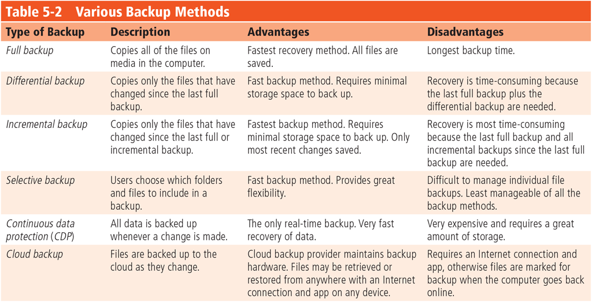

# CHAPTER 3 Types of computer system

|ITEM|DESCRIPTION|
|-|-|
Computer System | is a collection of entities(hardware, software and liveware) that are designed to receive, process, manage and present information in a meaningful format. As a digital electronic machine that can programmed to perform some operations as per the computer program instructions.
Computer hardware | Are physical parts/ intangible parts of a computer. 
Main computer hardware device | <ol><li>Input devices<li>output devices<li>central processing unit<li>storage devices
Computer software/ programs/ applications classification|**SYSTEM SOFTWARE** and **APPLICATION SOFTWARE**
Liveware/ orgware/ humanware | is the computer user. The user commands the computer system to execute on instructions.
type of computer system | <li>Desktop personal computer (PC)<li>Portable & mobile computer<li>Workstations<li>Servers<li>Data center
Desktop personal computer (PC)|It is designed to be in a stationary location, where all of its components fit on or under a desk or table.  On many desktops, the screen is housed in a display device that is separated from the system unit. 
All-in-one Computer|Uses same case to house the display and system unit. Some desktops and all-in-ones have displays that support touch (known as touch screen) Term ‘desktop’ also sometimes used to refer to an on-screen work area on laptops, tablets and desktops.
Mobile Computer|Personal computer you can carry from place to place **Examples:** notebook computers, laptop computers, netbooks, ultra-thins, and Tablet PCs
Mobile Device|Computing device small enough to hold in your hand **Examples:** smart phones and PDAs, e-book readers, handheld computers, portable media players, and digital cameras
Workstations |<li>A high-performance computer system that is basically designed for a single user and has advanced graphics capabilities, large storage capacity, and a powerful central processing unit<li>More capable than PC but less advanced than server<li>Workstations are used primarily to perform computationally intensive scientific and engineering tasks.
Servers, define|A computer dedicated to providing one or more services to other computers or devices on a network ( a collection of computers and devices connected often wirelessly) <li>Services provided by servers include storing content and controlling access to hardware, software and other resources on a network. (diagram)
Servers, method |<li> Can support from two to several thousands connected computers and devices at the same times<li>Available in a variety of sizes and types (small and large business applications.<li>Home user – smaller size and applications; larger corporate/government/web application use powerful, expensive servers to support their daily operations
Data center|<li>Physical facility that used to house their critical applications and data <li>Design is based on a network of computing and storage resources that enable the delivery of shared applications and data<li>Key components – routers, switches, firewalls, storage systems, servers and application-delivery controllers.

# CHAPTER 4 Network Fundamentals

|ITEM|DESCRIPTION|
|-|-|
Network Fundamentals | <li> Computer network consist the communications media, devices, and software needed to connect two or more computer systems or devices. <li> Enable users to share hardware, software, databases and facilitate communication
Network Nodes | The computers and devices on the networks.
Network Topology | The layout of the computers and devices in a communication network
Common network topologies | <li> Ring network <li> Bus network <li> Star network <li> Mesh network (matrix)
Ring Network Topology | 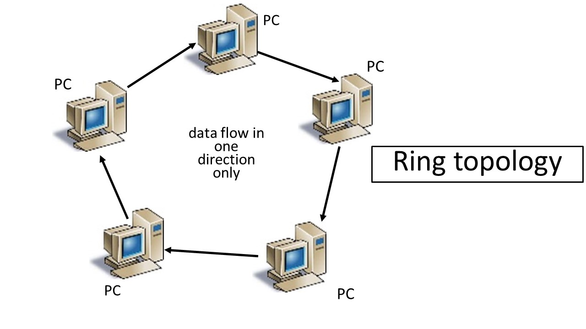
Bus Network Topology | 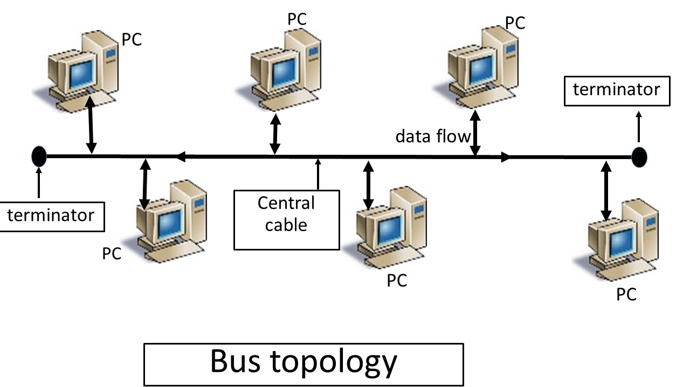
Star Network Topology | 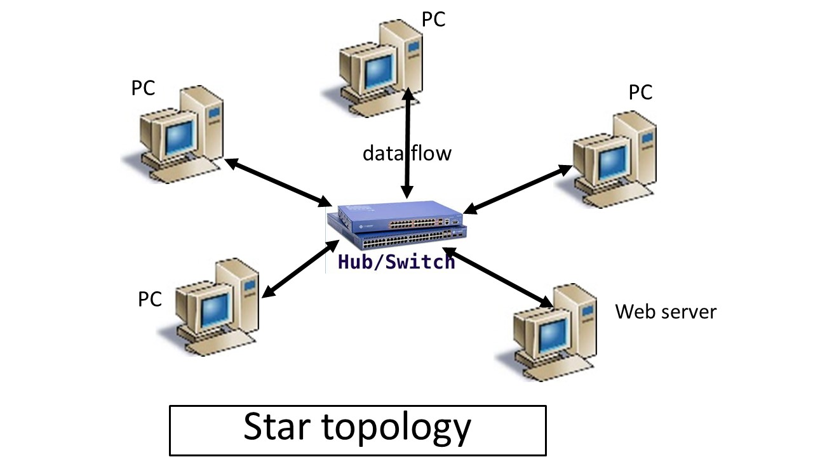
Mesh Network Topology | 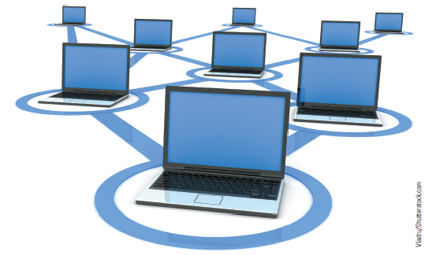
Personal Area Network (PAN) | Supports the interconnection of information technology close to one person
Local Area Network (LAN) | Connects computer systems and devices within a small area (e.g. an office or a home)
Metropolitan Area Network (MAN) | Connects users and their devices in an area that spans a campus or city
Wide Area Network (WAN) | Connects large geographic region
Network Systems, diagram | 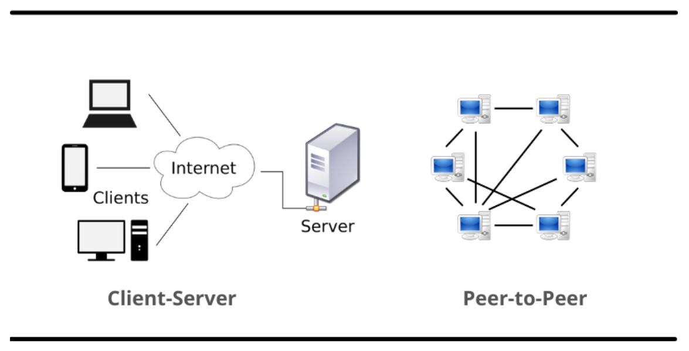
P2P (peer to peer) network | <li> A decentralized collection of computers that has been established to exchange information (such as file documents, songs, movies, software, etc) with everyone or only certain users <li> All computers on the network are considered equal, with each workstation offering access to resources and data. <li> Peer-to-Peer can be huge networks in which computers may interact with each other and share what is on or linked to their machines with other people.
PEER-TO-PEER Systems | <li> Example is Windows 10 updates. Microsoft’s servers and P2P are both used to deliver Windows 10 upgrades. <li> Some online gaming platforms make use of peer-to-peer (P2P) technology to allow players to download games. Diablo III, StarCraft II, and World of Warcraft are all distributed through peer-to-peer (P2P) by Blizzard Entertainment.
P2P Benefits/Disbenefits | 
Client/Server Systems | <li> Features multiple computer platforms dedicated to special functions, e.g., database management, printing, or communications. <li> A client is any computer that sends messages requesting services from the servers on the network. <li> A database server sends only the data that meets a specific query—not the entire file. <li> Server or host computer, controls access to the hardware, software and other resources on the network  and provides a centralized. <li>**Example:** Books
Client Server Benefits/Disbenefits | 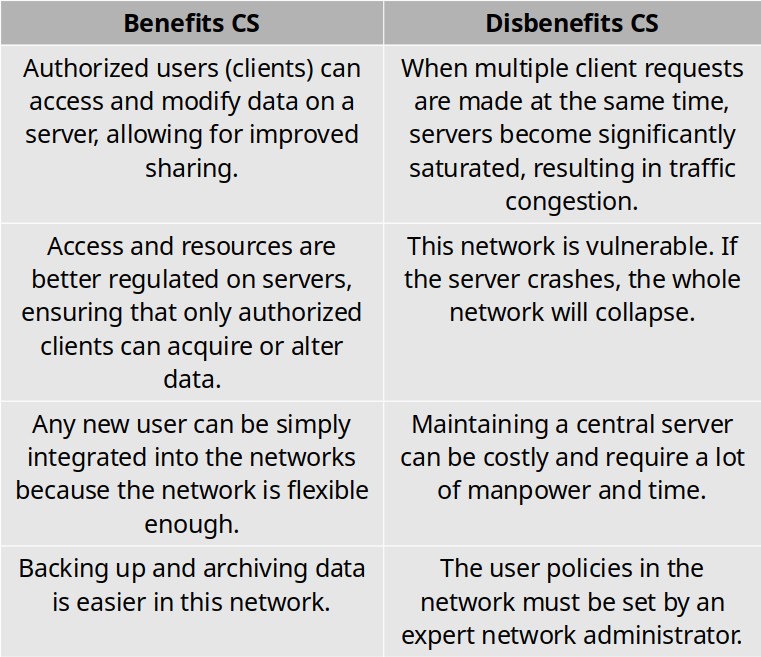

# CHAPTER 5 Computer Communication

|ITEM|DESCRIPTION|
|-|-|
Two broad categories of Communications Media | **Guided (wired) transmission media:** signals are guided along a solid medium  **Wireless:** the signal is broadcast over airwaves as a form of electromagnetic radiation.
Communications Media : physical | 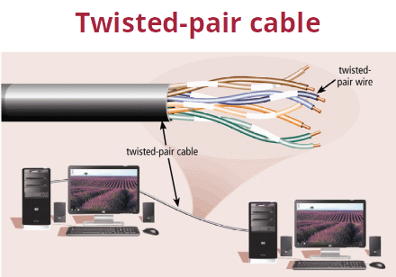 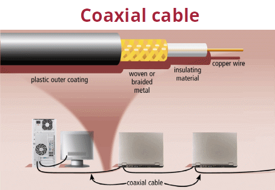 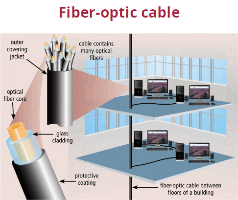 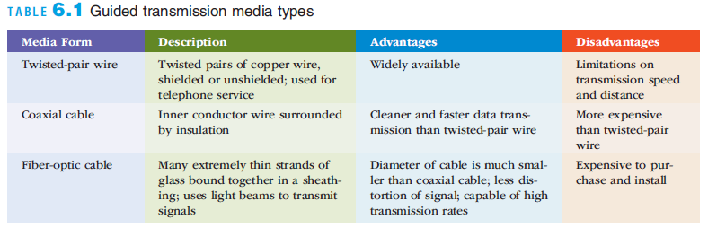
Communications Media: wireless |  <li> Wireless transmission involves the broadcast of communications in one of three frequency ranges <li>The signal must be broadcast within a specific frequency range to avoid interference with other wireless transmissions  
Communications Media: Wireless, types   | <li>Near field communication (NFC): a very short-range wireless connectivity technology <li>Designed for consumer electronics, cell phones, and credit cards <li>Bluetooth <li> Wi-Fi (based on 802.11) <li> Wi-Max (based on 802.16) <li> 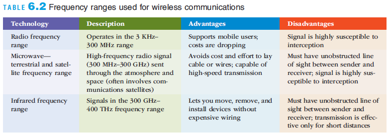
Microwave Transmission | Microwave is a high-frequency (300 MHz–300 GHz) signal sent through the air     Common forms of satellite communications: 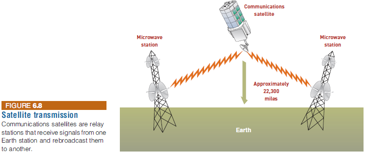 
Communications Hardware commons | 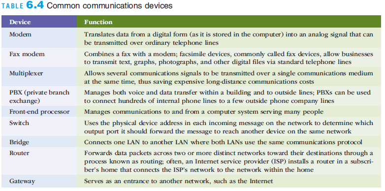
Communications Software |  **Network operating system (NOS):** <li> Systems software that controls the computer systems and devices on a network <li> Linux, UNIX, Windows Server, and Mac OS X are common NOSs    **Network-management software:** <li> Protects software from being copied, modified, or downloaded illegally <li> Locates telecommunications errors and potential network problems     **Mobile device management software:** <li> Manages and troubleshoots mobile devices remotely, pushing out applications, data, patches and settings