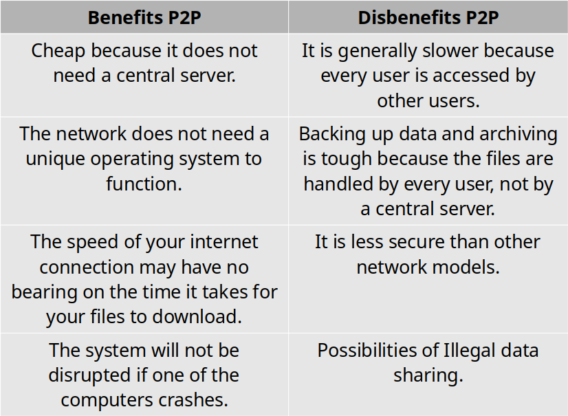

# IMC401 Quick Notes

**DISCLAIMER:** ***This content is not marketed to be fully complete, this is concise revision notes. Expect contents to be shorten or removed from the original notes. You have been warned.***

***Thanks to these contributors that helped in the making of the note:** Haziq (CDIM1C), Syazdwan (CDIM1B), Sufian (CDIM1B), Danish (CDIM1B), Afiq (CDIM1B), Haizi [Myself] (CDIM1C)*

# CHAPTER 1 Introduction to ICT

|ITEM|DESCRIPTION|
|-|-|
What is ICT? | ICT is the technology required for information processing, in particular, the use of electronic computers, communication devices and software applications to convert, store, protect, process, transmit and retrieve information from anywhere, anytime.
Information|***The knowledge obtained from reading, investigation, study or research.*** The tools to transmit information are the telephone, television and radio. We need information to make decisions and to predict the future.
Communication|***Communication is an act of transmitting messages.*** It is a process whereby information is exchanged between individuals using symbols, signs or verbal interactions. Communication is important in order to gain knowledge.
What is Digital Literacy? | ***It is the ability to understand and use information in multiple formats from a wide range of sources when it is presented via computers.*** It involves any number of digital reading and writing techniques across multiple media forms, including words, texts, visual displays, motion graphics, audio, video, and multimodal forms.
Categories of Digital Literacy (*Spires and Bartlett, 2012*) | <ol><li>**Locating and Consuming Digital Content:** There is consensus that effective Web search skills must be developed for a digital society, and instruments checklist being developed to ensure that they have the necessary prerequisite Web search skills </li></li><li> **Creating Content:** The implementation of digital content may be an important and effective method to embrace the 21st century skills that are expected to master. <li> **Communicating Digital Content:** Web 2.0 tools are social, participatory, collaborative, easy to use, and facilitate the creation of online communities which enable to communicate digital content using mobile devices such as cellphones and tablets that provides convenience and immediacy to the communication process for everyone.
What is computer? | A computer is an electronic device, operating under the control of instructions stored in its own memory.
Advantages of Using Computer| <ol><li>**Speed:** data, instructions, and information flow along electronic circuits in a computer at incredibly fast speeds.<li>**Reliability:** dependable and reliable because they rarely break or fail.<li>**Consistency:** produce the same results — consistently, generate error-free results<li>**Storage:** store enormous amounts of data and make this data available for processing anytime it is needed.<Li>**Communication:** computers can communicate with other computers, often wirelessly, and allow users to communicate with one another.
Disadvantages of Using Computer| <ol><li> Violation of privacy<li>Public safety<li>Impact on labour force<li>Impact on environment</li>*Health risks:* <li>Carpal<Li>tunnel syndromes<li>Vision problems<li>Backache<li>Headache
Computer Users | **Home user:** Spends time on the computer for personal and business, communication, personal financial management and web access. **Home Office:** User includes any company with fewer that 50 employees, as well as self-employed people that work out of their home. Mobile user: Travel to and from a main office or school to conduct business, communicate, or do homework. **Power user:** Such as an engineer, architect, or dekstop publisher--typically work with multimedia, and requires the capabilities of a workstation or other powerful computer. **Large business user:** Works for a company that has a large number of employess and computers usually connected to a network.
Computer application in society | <ol><li>Education<li> Government <li> Finance <li> Retail <li> Entertainment <li> Health Care <li> Science <li> Travel<li> Publishing <li> Manufacturing
**1** Education| <li> Computers are excellent tools for helping students learn specific skills, such as how to properly research online, create online content, and use digital tools for collaboration. <li> Computers can also be used to provide students with real-world experience that helps them to explore and apply their skills.
**1** Uses of computer in education | <ol><li>Enhancing Student Engagement<li>Improving Access to Information<li>Facilitating Collaboration<li>Personalizing the Learning Experience<li>Developing Digital Literacy<li>Enhancing Productivity and Efficiency<li>Utilizing Educational Software<li>Technology Tools for Teaching and Learning.
**2** Government |  Computers play an important roles in government. Some major fields in this category are: <li> Budgets <li> Sales tax department<li>income tax department<li> Male/Female ratio<Li>Computerization of voters lists<li>Computerization of driving licensing system<li>Weather forecasting
**3** Finance | <li>Computer is now mostly used in offices as one of the equipment in financial institutions and this computer performs many functions apart from calculating function. <li> It also performs different functions as data analysis, prediction, the identification of trend and even the creation of new approaches and ideas.
**4** Retail | <li>Computers can be used to buy and sell products online. This enables sellers to reach a wider market with low overheads, and buyers to compare prices, read reviews, and choose delivery preferences. <li> It offers a global address and makes it easy for both businesses and customers to deal with each other.
**5** Entertainment | <li> Computers are also playing very important role for the entertainment of human beings<li> Nowadays, computer can be used to watch television programs on the Internet<li>People can also watch movies, listen music, and play games on the computer.<li> Many computer games and other entertainment materials of different kinds are available on the Internet.
**6** Healthcare | Every area of the medical field uses computers such as laboratories, research offices, scanning, monitoring, pharmacy etc. which are helping the doctors to diagnose diseases and many other purposes 
**6** Example of healthcare | <li> Maintain patient history and other records<li> ICU (Intensive Care Unit)<li>Operation Theater<li>Recovery Room<li>Medical Ward<li>ECG<li>Diagnosis of Diseases<li>Telemedicine<li> Computer-aided surgery.
**7** Science| <li>Science for research and development<li>The computers have played a major role in most of what we know about ourselves and the universe<li>The satellites, the telescope and almost all research tool make use of computers in some or the other way.<li>The huge calculations required for space science, safe communication between scientist, storage of all gathered information are some of the computers uses in science and technology.
**8** Travel | <li> Online travel agencies such as expedia.com, are a large contribution to how the travel and tourism industries have changed due to technology.<li>These online agencies help users plan and book trips and provide comparisons of hotels, flights, vacation packages, prices and more, all in one place.
**9** Publishing | <li> Publishers use computers to design and produce hard-copy books and e-books, market books to readers and track sales. Readers download books and magazines to their phones, laptops and tablets to read wherever they go. <li> Reporters use the Internet to gather research<li>Many newspaper produce Web versions<li> Textbook was produced entirely on computer workstation<li> **Desktop publishing** is the production of printed matter by means of a printer linked to a desktop computer, with special software.<li>The system enables reports, advertising matter, etc., to be produced cheaply with a layout and print quality similar to that of typeset books.<li>For example, desktop publishing is utilized to create printed material, such as book covers, brochures, catalogs, flyers, magazines, and posters.
**10** Manufacturing | *Two groups:*<li>Computer monitoring and control of the manufacturing process. <li>Manufacturing support applications, which deal essentially with the preparations for actual manufacturing and post-manufacture operations</li>**Embedded computers** are extensively used in many manufacturing applications, especially for the control of production processes.

# CHAPTER 2 Components of computer hardware

|ITEM|DESCRIPTION|
|-|-|
Input | Any data and instructions entered into the memory of a computer
Input device | The hardware used to enter the data and instruction
Commonly used input methods| <li>Keyboard<li>Pointing Devices<li>Touch Screens<li>pen input<li>motion input<li>voice input<li>video input<li>scanners and reading devices.
Keyboard | An input device that contains keys you press to enter data and instructions into a computer or mobile device.
Keyboards have... | <li>Typing area<li>Function keys<li>Toggle keys<li>Navigation keys<li>Media control buttons<li>Internet control buttons<li>and Other special keys
Keyboard options | <li> Built-in laptop keyboard<li>Clip-on tablet keyboard<li>and On-screen keyboards.
Ergonomic keyboard design | Has a design that reduces the chance of repetitive strain injuries (RSIs) of wrist and hand.
Ergonomics incorporates... | comfort, efficiency, and safety in the design of the workplace.
Pointing device | The device that allow user to control the pointer or cursor on the screen.
Pointer | is a small symbol on the screen whose location and shape change as a user moves a pointing device.
Mouse| Is a pointing device that fits under the palm of your hand comfortably.
Mouse example | <li>Optical mouse<li>laser mouse<li>touch mouse<li>Mechanical mouse.
Touchpad | Small, flat, rectangular pointing device that is sensitive to pressure and motion.
Trackball |Stationary pointing device with a ball on its top or side.
Touch screen |Touch-sensitive display.
Pen input methodology| You touch a stylus or digital pen on a flat surface to write, draw, or make selections.
A graphics tablet (digitizer)|Electronic plastic board that detects and converts movements of a style or digital pen into signals that are sent to the computer.
Voice input |A process of entering input by speaking into a microphone.
Audio input |A process of entering any sound into the computer such as speech, music, and sound effects.
Video input |A process of capturing full-motion images and storing them on a computer or mobile device’s storage medium.
A webcam | A type of DV camera that enables a user to <li>Capture video and still images<li>Send email messages with video attachments<li>Broadcast live images or video over the Internet<li>Conduct video conferences<li>Make video calls.
Scanner | A light-sensing input device that reads printed text and graphics and then translates the results into a form the computer can process.
Types of scanners and reading devices| Flatbed scanner<li> Hand-held scanner<li> Sheet-fed scanner<li> Drum Scanner.
Optical reader | A device that uses a light source to read characters, marks, and codes and then converts them into digital data that a computer can process.
Optical reader example | <li>Optical character recognition (OCR)<li> Optical mark recognition (OMR)
Bar code reader/scanner methodology| Uses laser beams to read bar codes.
QR code methodology| Stores information in both a vertical and horizontal direction.
RFID (radio frequency identification)| Uses radio signals to communicate with a tag placed in or attached to an object.
RFID reader methodology| reads information on the tag via radio waves. 
RFID capabilities| <li>Can track times of runners in a marathon<li> Tracking location of people and other items<li> Checking lift tickets of skiers<li> Gauging temperature and pressure of tires on a vehicle<li> Checking out library books<li> Managing purchases<li> and Tracking payment as vehicles pass through booths on toll-way systems.
Magnetic-stripe readers methodology| Read the magnetic stripe on the back of cards such as <li>Credit cards<li> Entertainment cards<li> Bank cards<li> Identification cards<li> Other similar cards.
MICR (magnetic ink character recognition) devices| Read text printed with magnetized ink.
MICR reader methodology | Converts MICR characters into a form the computer can process.
MICR use case | Banking industry uses MICR for check processing. A data collection device obtains data directly at the location where the transaction or event takes place.
Case / Chassis | Contains and protects the electronics of the computer or mobile device from damage
What's inside desktop case? | <li>Sound card<li> Power supply and fan<li> Hard disk<li> Processor<li> Heat sink and fan<li> Memory module.
What's inside laptop case?| <li>Battery<li> Integrated sound ports and circuitry<li> Processor<li> Heat sink and fan<li> Memory module.
Motherboard | Is the main circuit board of the computer.
Motherboard contains | <li>Slots for memory modules<li> Slot for processor chips<li> CMOS battery<li> Ports to connect peripheral devices<li> Slots for adapter card.
Computer chip | Is a small piece of semiconducting material, usually silicon, on which integrated circuits are etched.
Processor / CPU methodology | Interprets and carries out the basic instructions that operate a computer.
Multi-core processor | Is a single chip with two or more separate processor cores.
Processors contain | <li>Control unit (CU) <li> arithmetic logic unit (ALU)
Control unit (CU) | Is the component of the processor that directs and coordinates most of the operations in the computer.
Arithmetic logic unit (ALU) | Performs arithmetic, comparison, and other operations.
Processor methodology|For every instruction, a processor repeats a set of four basic operations, which comprise a **machine cycle**.
Steps in machine cycle | 
Registers| Temporarily hold data and instructions.
System clock| Controls the timing of all computer operations.
Pace of the system clock is called | the **clock speed**, measured in gigahertz (GHz)
Manufacturers of processor chips | **Intel** and **AMD**
Processor chip downsides | It generates heat that could cause the chip to malfunction or fail. Therefore it require additional cooling like Heat sinks, Liquid cooling technology, or Cooling pads.
Memory definition | Consists of electronic components that store instructions waiting to be executed by the processor, data needed by those instructions, and the results of processing the data.
Memory stores... | <li>The operating system and other programs<li> Applications<li> Data being processed and the resulting information.
Memory methodology | Each byte resides temporarily in a location in memory that has an address.
Memory size units measurements | Gigabytes (GB)
Two kinds of memory| **Volatile memory:** Loses its contents when power is turned off. E.g.: RAM **Non volatile memory:** Does not lose contents when power is removed. E.g.: ROM, flash memory, and CMOS.
Types of RAM | <li>Dynamic RAM (DRAM)<li> Static RAM (SRAM)
RAM chips | Usually reside on a memory module and are inserted into memory slots.
Memory cache | Speeds the processes of the computer because it stores frequently used instructions and data.  
Read-only memory (ROM) | Memory chips storing permanent data and instructions.
ROM example | Firmware
Flash memory method | Can be erased electronically and rewritten.
CMOS | Uses battery power to retain information when the power to the computer is off.
Access time | The amount of time it takes the processor to read from memory.
Access time measurement | Nanoseconds
Adapter card function | enhances functions of a component of a desktop or server system unit and/or provides connections to peripheral devices.
Adapter card example| <li>Sound card <li>video card.
Expansion slot | A socket on a desktop or server motherboard that can hold an adapter card.
Plug and Play technology| the computer automatically can recognize peripheral devices as you install them.
USB adapter | enhances functions of a mobile computer and/or provides connections to peripheral devices.
Bus | allows the various devices both inside and attached to the system unit to communicate with one another.
Example of buses | <li>Data bus<li> Address bus.
Word size | The number of bits the processor can interpret and execute at a given time.
A computer might have these three types of buses | **System bus:** Connect processor to main memory (RAM). **Backside bus:** Connect processor to memory cache. **Expansion bus:** Connect processor to peripherals.
Power supply / laptop AC adapter function | Converts the wall outlet AC power into DC power. Mobile computers and devices can run using either a power supply or batteries.
Batteries composition | Rechargeable lithium-ion batteries.
Output | Is data that has been processed into a useful form.
Output device | the hardware component that conveys information to the user.
Display | visually conveys text, graphics, and video information.
Monitor | A display that is packaged as a separate peripheral device like Liquid Crystal Display (LCD), Light Emitting Diodes (LED), Cathode Ray Tube (CRT), Plasma.
Display specs | Resolution<li> Response time<li> Brightness<li> Dot pitch<li> Contrast ratio.
Monitors zaman now | use a digital signal to produce a picture.
Monitor ports | <li>Digital video interface (DVI) port<li> High definition media interface (HDMI) port<li> or A Display Port.
Home users | Use a **digital television (DTV)** as a display. **HDTV** is the most advanced form of digital television. A **Smart TV** is an Internet-enabled HDTV
Data projector | A device that projects the text and images displaying on a computer or mobile device screen on a larger screen so that an audience can see the image clearly.
Interactive whiteboard | A touch-sensitive device, resembling a dry-erase board, that displays the image on a connected computer screen.
Printer define | An output device that produces text and graphics on a physical medium.
Nonimpact printer | forms characters and graphics on a piece of paper without actually contacting the paper.
**Types of printer:** | ^
Ink-jet printers| Forms characters and graphics by spraying tiny drops of liquid ink onto a piece of paper Colour or black-and-white Speed is measured by the number of pages per minute (ppm) it can print.
Photo printers | A colour printer that produces lab-quality photos Many use ink-jet technology 
Laser printers | High-speed High-quality Colour Black-and-white
All-in-one printers | A single device that prints, scans, copies, and in some cases, faxes. Also called a multifunction printer.
3-D printers| Use a process called additive manufacturing to create an object by adding material to a three-dimensional object, one horizontal layer at a time.
Thermal printers| A thermal printer generates images by pushing electrically heated pins against the heat-sensitive paper
Mobile printers| A mobile printer is a small, lightweight, battery-powered printer that allows a mobile user to print from a mobile device
Label printers | A label printer is a small printer that prints on an adhesive-type material that can be placed on a variety of items
Plotters |Used to produce high-quality drawings.
Large-format printers | create photo-realistic quality color prints
Impact printers| Form characters and graphics on a piece of paper by striking a mechanism against an inked ribbon that physically contacts the paper.
Others| <li>Line printer<li>Dot-matrix printer<li>Daisy wheel printer<li>Drum printer<li>Chain printer<li>Band printer
Sound output devices | Attach **surround sound speakers** or **speaker systems** to their computers, game consoles, and mobile devices to generate higher-quality sounds. **Headphones** are speakers that cover or are placed outside of the ear. **Ear-buds** (also called earphones) rest inside the ear canal.
Output Feedback Devices | Joysticks, wheels, gamepads, and motion-sensing game controllers can be considered output devices when they include force feedback. It is a technology that sends resistance to the device in response to actions of the user.
Storage device | is the hardware that records and/or retrieves items to and from storage media.
Reading | is the process of transferring items from a storage medium into memory.
Writing | is the process of transferring items from memory to a storage medium.
Capacity | is the number of bytes a storage medium can hold.
Access time | Amount of time it takes a storage device to locate an item on a storage medium, and The time required to deliver an item from memory to the processor.
Hard Disk Drive (HDD) | Contains one or more inflexible, circular platters that use magnetic particles to store data, instructions, and information.
Storage capacity of HDD determined by | <li>The number of platters the hard disk contains<li>The composition of the magnetic coating on the platters<li>Whether the disk uses longitudinal or perpendicular recording.<li>Density.
Formatting | The process of dividing the disk into tracks and sectors.
Solid State Drive | A flash memory storage device that contains its own processor to manage its storage.
SSD advantages over HDD | <li>Faster access times<li>Faster transfer rates<li>Quieter operation<li>More durable<li>Lighter weight<li>Less power consumption<li>Less heat generation<li>Longer life<li>Defragmentation not required.
EXTERNAL Hard Drives
External hard drive | A separate freestanding storage device that connects with a cable to a USB port or other port on a computer or mobile device
Memory card | A removable flash memory storage device that you insert and remove from a slot in a computer, mobile device, or card reader/writer.
Memory card types | <li>SDHC<li>SDXC<li>miniSD<li>microSDHC<li>microSDXC<li>CF<li>xD Picture Card<li>Memory Stick PRO Duo<li>M2
USB flash drives method | plug into a USB port on a computer or mobile device.
Cloud storage | An Internet service that provides storage to computer or mobile device users.
Optical disc | consists of a flat, round, portable disc made of metal, plastic, and lacquer that is written and read by a laser.
Optical discs method | store items in a single track that spirals from the center of the disc to the edge of the disc. Track is divided into evenly sized sectors.
Types of Optical Discs | <li>A CD-ROM can be read from but not written to (Single-session disc). <li>A CD-R is an optical disc on which users can write once, but not erase.<li>A CD-RW is an erasable multisession disc.
Enterprise storage | Allows large organizations to manage and store data and information using devices intended for heavy use, maximum efficiency, and maximum availability.
RAID method | Duplicates data, instructions, and information to improve data reliability.
Network attached storage (NAS) | A server that is placed on a network with the sole purpose of providing storage to users, computers, and devices attached to the network.
Storage area network (SAN) |A high-speed network with the sole purpose of providing storage to other attached servers.
Tape |A magnetically coated ribbon of plastic capable of storing large amounts of data and information.
Tape drive method| reads and writes data and information on a magnetic tape.
Magnetic stripe card | has a magnetic stripe that contains information.
Smart card | stores data on an integrated circuit embedded in the card.
NFC | NFC-enabled device contains an NFC (Near Field Communication) chip. Most NFC tags are self-adhesive.
Backup Methods | 

# CHAPTER 3 Types of computer system

|ITEM|DESCRIPTION|
|-|-|
Computer System | is a collection of entities(hardware, software and liveware) that are designed to receive, process, manage and present information in a meaningful format. As a digital electronic machine that can programmed to perform some operations as per the computer program instructions.
Computer hardware | Are physical parts/ intangible parts of a computer. 
Main computer hardware device | <ol><li>Input devices<li>output devices<li>central processing unit<li>storage devices
Computer software/ programs/ applications classification|**SYSTEM SOFTWARE** and **APPLICATION SOFTWARE**
Liveware/ orgware/ humanware | is the computer user. The user commands the computer system to execute on instructions.
type of computer system | <li>Desktop personal computer (PC)<li>Portable & mobile computer<li>Workstations<li>Servers<li>Data center
Desktop personal computer (PC)|It is designed to be in a stationary location, where all of its components fit on or under a desk or table.  On many desktops, the screen is housed in a display device that is separated from the system unit. 
All-in-one Computer|Uses same case to house the display and system unit. Some desktops and all-in-ones have displays that support touch (known as touch screen) Term ‘desktop’ also sometimes used to refer to an on-screen work area on laptops, tablets and desktops.
Mobile Computer|Personal computer you can carry from place to place **Examples:** notebook computers, laptop computers, netbooks, ultra-thins, and Tablet PCs
Mobile Device|Computing device small enough to hold in your hand **Examples:** smart phones and PDAs, e-book readers, handheld computers, portable media players, and digital cameras
Workstations |<li>A high-performance computer system that is basically designed for a single user and has advanced graphics capabilities, large storage capacity, and a powerful central processing unit<li>More capable than PC but less advanced than server<li>Workstations are used primarily to perform computationally intensive scientific and engineering tasks.
Servers, define|A computer dedicated to providing one or more services to other computers or devices on a network ( a collection of computers and devices connected often wirelessly) <li>Services provided by servers include storing content and controlling access to hardware, software and other resources on a network. (diagram)
Servers, method |<li> Can support from two to several thousands connected computers and devices at the same times<li>Available in a variety of sizes and types (small and large business applications.<li>Home user – smaller size and applications; larger corporate/government/web application use powerful, expensive servers to support their daily operations
Data center|<li>Physical facility that used to house their critical applications and data <li>Design is based on a network of computing and storage resources that enable the delivery of shared applications and data<li>Key components – routers, switches, firewalls, storage systems, servers and application-delivery controllers.

# CHAPTER 4 Network Fundamentals

|ITEM|DESCRIPTION|
|-|-|
Network Fundamentals | <li> Computer network consist the communications media, devices, and software needed to connect two or more computer systems or devices. <li> Enable users to share hardware, software, databases and facilitate communication
Network Nodes | The computers and devices on the networks.
Network Topology | The layout of the computers and devices in a communication network
Common network topologies | <li> Ring network <li> Bus network <li> Star network <li> Mesh network (matrix)
Ring Network Topology | 
Bus Network Topology | 
Star Network Topology | 
Mesh Network Topology | 
Personal Area Network (PAN) | Supports the interconnection of information technology close to one person
Local Area Network (LAN) | Connects computer systems and devices within a small area (e.g. an office or a home)
Metropolitan Area Network (MAN) | Connects users and their devices in an area that spans a campus or city
Wide Area Network (WAN) | Connects large geographic region
Network Systems, diagram | 
P2P (peer to peer) network | <li> A decentralized collection of computers that has been established to exchange information (such as file documents, songs, movies, software, etc) with everyone or only certain users <li> All computers on the network are considered equal, with each workstation offering access to resources and data. <li> Peer-to-Peer can be huge networks in which computers may interact with each other and share what is on or linked to their machines with other people.
PEER-TO-PEER Systems | <li> Example is Windows 10 updates. Microsoft’s servers and P2P are both used to deliver Windows 10 upgrades. <li> Some online gaming platforms make use of peer-to-peer (P2P) technology to allow players to download games. Diablo III, StarCraft II, and World of Warcraft are all distributed through peer-to-peer (P2P) by Blizzard Entertainment.
P2P Benefits/Disbenefits | 
Client/Server Systems | <li> Features multiple computer platforms dedicated to special functions, e.g., database management, printing, or communications. <li> A client is any computer that sends messages requesting services from the servers on the network. <li> A database server sends only the data that meets a specific query—not the entire file. <li> Server or host computer, controls access to the hardware, software and other resources on the network  and provides a centralized. <li>**Example:** Books
Client Server Benefits/Disbenefits | 

# CHAPTER 5 Computer Communication

|ITEM|DESCRIPTION|
|-|-|
Two broad categories of Communications Media | **Guided (wired) transmission media:** signals are guided along a solid medium  **Wireless:** the signal is broadcast over airwaves as a form of electromagnetic radiation.
Communications Media : physical |    
Communications Media: wireless |  <li> Wireless transmission involves the broadcast of communications in one of three frequency ranges <li>The signal must be broadcast within a specific frequency range to avoid interference with other wireless transmissions  
Communications Media: Wireless, types   | <li>Near field communication (NFC): a very short-range wireless connectivity technology <li>Designed for consumer electronics, cell phones, and credit cards <li>Bluetooth <li> Wi-Fi (based on 802.11) <li> Wi-Max (based on 802.16) <li> 
Microwave Transmission | Microwave is a high-frequency (300 MHz–300 GHz) signal sent through the air     Common forms of satellite communications:  
Communications Hardware commons | 
Communications Software |  **Network operating system (NOS):** <li> Systems software that controls the computer systems and devices on a network <li> Linux, UNIX, Windows Server, and Mac OS X are common NOSs    **Network-management software:** <li> Protects software from being copied, modified, or downloaded illegally <li> Locates telecommunications errors and potential network problems     **Mobile device management software:** <li> Manages and troubleshoots mobile devices remotely, pushing out applications, data, patches and settings

# CHAPTER 6 Cloud Computing

|ITEM|DESCRIPTION|
|-|-|
Cloud Computing | A computing environment in which software and storage are provided as an Internet service and accessed with a Web browser
Advantages to businesses | <li> Businesses can save on system design, installation, and maintenance. <li> Increased efficiency and reduce the costs of new product and service launches <li> Employees can access corporate systems from any Internet-connected computer
Public Cloud  | <li> A service provider owns and manages the infrastructure with cloud user organizations (tenants) accessing slices of shared hardware resource via the Internet <li> Cloud service maintained by an external service provider, access through the Internet and available to the public. <li> Public cloud computing can be a faster, cheaper, and more agile approach to building and managing your own IT infrastructure <li> Data security is a key concern
Public Cloud | Divided into three main types of services: <li> Infrastructure as a service (IaaS) <li> Software as a service (SaaS) <li> Platform as a Service (PaaS)
Software-as-a-Service (SaaS) | Software as a service (SaaS) is a method for delivering software applications over the internet, on demand and typically on a subscription basis. With SaaS, cloud providers host and manage the software application and underlying infrastructure, and handle any maintenance, like software upgrades and security patching. Users connect to the application over the internet, usually with a web browser on their phone, tablet, or PC.
Platform-as-a-Service (PaaS) | Platform as a service (PaaS) refers to cloud computing services that supply an on-demand environment for developing, testing, delivering, and managing software applications. PaaS is designed to make it easier for developers to quickly create web or mobile apps, without worrying about setting up or managing the underlying infrastructure of servers, storage, network, and databases needed for development.
Infrastructure-as-a-Service (IaaS| The most basic category of cloud computing services. With infrastructure as a service (laaS), you rent IT infrastructure—servers and virtual machines (VMs), storage, networks, operating systems—from a cloud provider on a pay-as-you-go basis.
Serverless Computing | Overlapping with PaaS, serverless computing focuses on building app functionality without spending time continually managing the servers and infrastructure required to do so. The cloud provider handles the setup, capacity planning, and server management for you. Serverless architectures are highly scalable and event-driven, only using resources when a specific function or trigger occurs.
Private Cloud | <li> A single tenant cloud <li> Organization often implement due to concerns that their data will not be secure in a public cloud <li>Can be divided into two types:  1) On-premise private cloud  2) Service provider managed private cloud.

# CHAPTER 7 : Virtual Workspace

|ITEM|DESCRIPTION|
|-|-|
Virtual Workspace | <li> The term “virtual workspace” is generally used to describe a working environment where users digitally connect to each other regardless of their physical location. <li> Users in a virtual workspace work together using tools that foster communication and collaboration. <li> While this type of virtual environment started as a way to replicate a physical office, virtual workspaces are now used to improve efficiency, collaboration, and security.
The Elements of Virtual Workspace | <li>Unification<li>Security<li>Automation
Unification | <li>Involves centralizing apps, desktops, and data. Users can collaborate and work on the same projects and documents. <li>Allows users to access documents, data, and tools they need for work from a central interface that works from any device.
Security | <li> A virtual workspace enhances security since it gives IT teams centralized control over each point of access. <li> An efficient workspace includes advanced security features such as single sign-on access control and security analytics. <li> Workers can securely sign on from anywhere on any device, ensuring a great user experience. The analytics capabilities ensure the detection of internal threats before they turn into a bigger problem.
Automation | <li> An effective virtual workspace uses artificial intelligence technologies such as machine learning to automate and streamline frequent tasks. <li> Users can save time and effort by using microapps to automate their workflows.
Essential Items For Virtual Workspace | <li> High speed Internet & modern telecommunications systems <li> An updated and optimized website <li>Functional web chat tools <li>Designated meeting, events, and coworking spaces <li>Auto/live receptionist for a professional answering service
Who Benefits From Virtual Workspace | <li>The Hybrid Workforce<li>Remote Workers<li>Mobile Workers<li>Healthcare Employees
The hybrid workforce | <li> Working some days from the office and partially from home can be a challenge for hybrid workers. <li> A virtual workspace ensures employees use the same interface, regardless of where they are. <li> Users have the same experience and can collaborate on the same workspace, both at home and at the office. 
Remote workers | <li>Employees who always work remotely can benefit from a unified virtual workspace particularly when it comes to security. <li>Remote teams, such as customer support and call centers, can comply with data privacy regulations with a secured cloud workspace, including PCI DSS.
Mobile workers | <li> Workers on the go, like those on delivery, transportation, or traveling for work, can work securely with a virtual workspace. <li> Employees can safely log in and continue working securely from remote locations. 
Healthcare employees | <li> First responders, healthcare workers, and doctors can have real-time and secure access to a patient’s data wherever they are. <li> The virtual workspace can save time while enforcing privacy by encrypting all data by default, keeping it accessible only to authorized personnel.
Advantages of Virtual Workspace | <li> Lower costs: A virtual workspace allows employees to work from anywhere, so there is no need for a large office space. <li> More employee satisfaction: A virtual workspace centralizes the technology stack, simplifying the work and saving the employees’ time <li>Better cloud migration: A secure virtual workspace can help the migration process run smoothly. <li>Improved productivity: Simplified workflows save staff time and effort, allowing workers to focus on their core business.<li>Business continuity: A virtual environment enables companies to continue activities in times of crisis. <li>Access to more market opportunities and talent: In a virtual work environment, the recruiting pool is broader. <li> Scalability: A virtual environment means operations can be easily scaled up or down. <li> Increased security: Access permission control capabilities ensure only authorized users have access to sensitive data. <li> Better IT management: The centralization of a virtual workspace also gives IT teams more visibility into endpoints, traffic, access, and network activity. <li> Sustainability: The flexibility of working in hybrid teams reduces commuting, resulting in lower carbon emissions. <li> Flexibility: Adding apps and software solutions to a virtual environment is easier than with an on-premises workspace. 
Disadvantages of Virtual Workspace |  <li> Less face-to-face interaction: Virtual interactions lack important social cues such as body language, facial expressions, and physical interactions <li> Potential employee burnout: It is important to set proper boundaries to avoid “Zoom fatigue.” <li> Cultural and Socioeconomic concerns: Awareness of cultural and socioeconomic factors, such as embarrassing backgrounds, living arrangements, or appearance on camera.
The 9 Best Virtual Workspaces | 

# CHAPTER 8 System Software

|ITEM|DESCRIPTION|
|-|-|
Operating Systems | An operating system (OS) is a set of programs that coordinate all the activities among computer or mobile device hardware
OS USE CASE | <li>Start and shut down a computer or mobile device<li>Provide a user interface<li>Manage programs<li>Manage memory<li>Coordinate tasks<li>Configure devices<li>Monitor performance<li>Establish an Internet connection<li>Provide file management and other device or media-related tasks<li>Updating operating system software<li>Control a network<li>Administer security
SOFTWARE | <li>A program, or software, consists of a series of related instructions, organized for a common purpose, that tells the computer what tasks to perform and how to perform them<li>The two categories of software are system software and application software.<li>System software consists of the programs that control or maintain the operations of the computer and its devices. System software serves as the interface between the user, the application software, and the computer’s hardware. Two types of system software are the operating system and utility programs.
OS Functions: 1. Start or Shut down | <li>Starting Computers and Mobile Devices from Cold boot, Warm boot, or Reboot <li>An operating system includes various power options<li>Sleep mode saves any open documents and running programs or aps to RAM, turns off all unneeded functions, and then places the computer in a low-power state<li>Hibernate mode saves any open documents and running programs or apps to an internal hard drive before removing power from the computer or device
OS Functions: 2. User Interface | <li>A user interface (UI) controls how you enter data and instructions and how information is displayed on the screen<li>With a graphical user interface (GUI), you interact with menus and visual images<li>In a command-line interface, a user types commands represented by short keywords or abbreviations or presses special keys on the keyboard to enter data and instructions<li>Menu-driven interface provides options or menu for users to select an action.
OS Functions: 3. Manage Programs |<li>How an operating system handles programs directly affects your productivity:<li>Single tasking and multitasking<li>Foreground and background<li>Single user and multiuser
OS Functions: 4. Memory Management |<li>Memory management optimizes the use of the computer or device’s internal memory<li>Virtual memory is a portion of a storage medium functioning as additional RAM</li>
OS Functions: 5. Coordinate Task | <li>The operating system determines the order in which tasks are processed</li>
OS Functions: 6. Configure Devices | <li>A driver is a small program that tells the operating system how to communicate with a specific device<li>Plug and Play automatically configures new devices as you install or connect them 
OS Functions: 7. Performance Monitor | <li>A performance monitor is a program that assesses and reports information about various computer resources and devices.
OS Functions: 8. Establish Internet Connection |  <li>Operating systems typically provide a means to establish Internet connections.
OS Functions: 9. Software Updates |<li>Many programs, including operating systems, include an automatic update feature that regularly provides new features or corrections to the program.
OS Functions: 10. Utility Management | Operating systems often provide users with a variety of tools related to managing a computer, its devices, or its programs:<li>File Manager<li>Search<li>Image Viewer<li>Uninstaller<li>Disk Cleanup<li>Disk Defragmenter<li>Screen Saver<li>File Compression<li>PC Maintenance<li>Backup and Restore<li>Power Management
OS Functions: 11. Controls a Network |<li>Some operating systems are designed to work with a server on a network<li>These multiuser operating systems allow multiple users to share a printer, Internet access, files, and programs A network administrator uses the server operating system to:<li>Add and remove users, computers, and other devices<li>Configure the network, install software and administer network security
OS Functions: 12. Administer Security | <li>A user account enables a use to sign in to, or access resources on, a network or computer<li>A user name, or user ID, identifies a specific user<li>A password is a private combination of characters associated with the user name<li>(diagram)
Types of Operating Systems |<li>**Desktop:** Windows, macOS, UNIX, Linux, Chrome OS.<li>**Server:** Windows Server, macOS Server, UNIX, Linux<li>**Mobile:** Google Android, Apple iOS, Windows (Mobile Edition). <li>Embedded
Desktop Operating Systems |<li>A desktop operating system is a complete operating system that works on desktops, laptops, and some tablets.<li>The Macintosh operating system has earned a reputation for its ease of use.<li>UNIX is a multitasking operating system developed in the early 1970s<li>Linux is a popular, multitasking UNIX-based operating system<li>Chrome OS is a Linux-based operating system designed to work primarily with web apps.
Server Operating Systems | <li>Windows Server<li>Mac-OS Server<li>UNIX<li>Linux
Mobile Operating Systems | <li>The operating system on mobile devices and many consumer electronics is called a mobile operating system and resides on firmware<li>Android: Android is an open source, Linux-based mobile operating system designed by Google <li>iOS: iOS, developed by Apple, is a proprietary mobile operating system specifically made for Apple’s mobile devices<li>Windows: Windows (Mobile Edition), developed by Microsoft, is a proprietary mobile operating system 
Embedded Operating Systems | <li>An embedded operating system resides on a ROM chip on a mobile device or consumer electronic device.

# CHAPTER 9 Application software

|ITEM|DESCRIPTION|
|-|-|
Programs and Apps|<li>A program, or software, consists of a series of related instructions, organized for a common purpose, that tells the computer what tasks to perform and how to perform them<li>An application, or app, sometimes called application software, consists of programs designed to make users more productive and/or assist them with personal tasks
Programs and Apps Technologies|<li>Native app<li>Cloud app<li>Web app<li>Mobile web app</li>*Programs and apps are distributed in a variety of forms:*<li>Retail software<li>Custom software<li>Shareware<li>Freeware<li>Open source software<li>Public domain software
Categories of Application software|<li>Productivity applications<li>Graphic and Multimedia Applications<li>Communication Applications
Productivity Applications (slide 1 of 15)|Productivity applications can assist you in becoming more effective and efficient while performing daily activities at work, school, and home<li>**Using Apps safely**:<li>Evaluate the apps<li>Use strong passwords<li>Use security on smartphones<li>**Verify the transactions**<li>Word processing<li>Presentation<li>Spreadsheet<li>Database<li>Note taking<li>Calendar and contact management<li>Project management<li>Accounting<li>Personal finance<li>Legal<li>Tax preparation<li>Document management<li>Support services<li>Enterprise computing
Productivity Applications (slide 2 of 15)|**With productivity applications, users often**:<li>Create a project<li>Edit a project<li>Format a project<li>Save a project<li>Distribute a project
Productivity Applications (slide 3 of 15|Word processing software allows users to create and manipulate documents<LI>People use word processing software to develop documents such as letters, memos, reports, mailing labels, and newsletters(diagram)
Productivity Applications (slide 4 of 15)|<LI>Presentation software allows users to create visual aids for presentations to communicate ideas, messages, and other information to a group(diagram)
Productivity Applications (slide 5 of 15)|<LI>Spreadsheet software allows users to organize data in columns and rows and perform calculations on the data(diagram)
Productivity Applications (slide 6 of 15)|<LI>A database is a collection of data organized in a manner that allows access, retrieval, and use of that data<LI>Database software allows users to create, access, and manage a database(diagram)
Productivity Applications (slide 7 of 15)|<LI>Note taking software is an application that enables users to enter typed text, handwritten comments, drawings, sketches, photos, and links anywhere on a page(diagram)
Productivity Applications (slide 8 of 15)|<lI>Calendar and contact management software helps you organize your calendar, keep track of contacts, and share this information with other users(diagram)
Productivity Applications (slide 9 of 15)|<LI>A software suite is a collection of individual related applications available together as a unit<LI>Project management software is an application that allows a user to plan, schedule, track, and analyze the events, resources, and costs of a project(diagram)
Productivity Applications (slide 10 of 15)|<LI>Accounting software is an application that helps businesses of all sizes record and report their financial transactions(diagram)
Productivity Applications (slide 11 of 15)|Personal finance software is a simplified accounting application that helps home users and small/home office users balance their checkbooks, pay bills, track personal income and expenses, verify account balances, transfer funds, track investments, and evaluate financial plans(diagram)
Productivity Applications (slide 12 of 15)|<LI>Legal software is an application that assists in the preparation of legal documents and provides legal information to individuals, families, and small businesses(diagram)
Productivity Applications (slide 13 of 15)|Tax preparation software is an application that can guide individuals, families, or small businesses through the process of filing federal and state taxes(diagram)
Productivity Applications (slide 14 of 15)|Document conversion software saves documents created in any application into a common format that has the same appearance as the original document(diagram)
Productivity Applications (slide 15 of 15)|A large organization, commonly referred to as an enterprise, requires special computing solutions because of its size and geographic distribution<LI>Human resources software<LI>Accounting and<LI>finance software<LI>Engineering or product development software<LI>Manufacturing software<LI>Marketing software<LI>Sales software<LI>Distribution software<LI>Customer service software<LI>Information technology software
Graphics and Media Software (slide 1 of 5)|<lI>Computer-aided<LI>design (CAD) software<LI>Desktop<LI>publishing software<LI>Paint/Image editing software<LI>Graphics and Media Software (slide 2 of 5)<LI>Photo editing and photo management software<LI>Video and audio editing software
Graphics and Media Software (slide 3 of 5)|<LI>Multimedia authoring software allows users to combine text, graphics, audio, video, and animation in an interactive application<LI>Website authoring software helps users create business websites for a variety of purposes.
Graphics and Media Software (slide 4 of 5)|<LI>A media player is a program that allows you to view images and animations, listen to audio, and watch video files on your computer or mobile device<LI>An augmented reality app overlays information and digital content on top of physical objects or locations<LI>A virtual reality app provides an immersive user experience
Communications Applications|<LI>Blog<LI>Browser<LI>Chat<LI>Online Discussion<LI>Email<LI>File Transfer<LI>Internet Phone<LI>Internet Messaging<LI>Mobile (Text) Messaging<LI>Videoconference
Utility Software|A type of system software that allows a user to perform maintenance-type tasks.
Security Tools|<LI>A personal firewall is a security tool that detects and protects a personal computer and its data from unauthorized intrusions <LI>An antivirus program protects a computer against viruses by identifying and removing any computer viruses found in memory, on storage media, or on incoming files(diagram).<LI> Spyware is a type of program placed on a computer or mobile device without the user’s knowledge that secretly collects information about the user and then communicates the information it collects to some outside source while the user is online <LI>Adware is a type of program that displays an online advertisement in a banner or pop-up or pop-under window on webpages, email messages, or other Internet services. A spyware remover is a type of program that detects and deletes spyware and similar programs<LI>An adware remover is a program that detects and deletes adware<LI>Anti-spam programs<LI>Web filtering software<LI>Phishing filters<LI>Pop-up and pop-under blockers
File, Disk, and System Management Tools|<LI>A file manager is a tool that performs functions related to file management(diagram)<LI>A search tool is a program, usually included with an operating system, that attempts to locate a file, contact, calendar event, app, or any other item stored on your computer or mobile device based on criteria you specify(diagram)<LI>An image viewer is a tool that allows users to display, copy, and print the contents of a graphics file, such as a photo<LI>An uninstaller is a tool that removes a program, as well as any associated entries in the system files(diagram)<LI>A disk cleanup tool searches for and removes unnecessary files(diagram)<LI>A disk defragmenter is a tool that reorganizes the files and unused space on a computer’s hard disk so that the operating system accesses data more quickly and programs run fasterDefragmenting(diagram)<LI>A screen saver is a tool that causes a display device’s screen to show a moving image or blank screen if no keyboard or mouse activity occurs for a specified time<LI>A file compression tool shrinks the size of a file(s)<LI>A PC maintenance tool is a program that identifies and fixes operating system problems, detects and repairs drive problems, and includes the capability of improving a computer’s performance<LI>A backup tool allows users to copy, or back up, selected files or the contents of an entire storage medium to another storage location<LI>A restore tool reverses the process and returns backed up files to their original form<LI>A power management tool monitors a laptop or mobile device’s battery usage, showing apps that consume the most battery power, displaying battery usage since the device was last charged, and estimating usage time remaining

# CHAPTER 10 Software Issues and Trends

|ITEM|DESCRIPTION|
|-|-|
What is SOFTWARE ISSUES AND TRENDS? | <ol><li>In software testing circles, it denotes the existence of some anomaly or flaw in a software system that requires resolution. Therefore, an issue can be anything from a bug, missing or incorrect documentation, a request for changing a feature, or some other task to be accomplished<li>Software trends refer to any latest discovery and advancement that grab an eye of attention of many users whereas the capability of the software found to be meaningful and useful for usage.<li>There are various types of software issues and trends exist align with the rapid development of IT/IS worldwide
MOBILE APPLICATION SOFTWARE | <li> A mobile application or app is a computer program or software application designed to run on a mobile device such as a phone, tablet, or watch.<li>The applications are built as a miniature icon which is limited to a certain extent of functions and generally developed by any coding languages.<li> Each application provides individual functionalities and enables multitasking. <li> It allows the user to choose their preferred applications according to their demand. <li> The applications are designed as a classy approach which has is its own advantages and limitations and its surpassed by the intelligent accessibility by the user.
TYPES OF MOBILE APPLICATION SOFTWARE |  The widely available mobile software is divided into the main three categories: <ol><li> **Native Applications**  - The native application has broad access to visual and structural elements that is available in storage space.   - The application is used to save the marketing advantages and limitations such as data interpretations and ranking but its restricted for its own demands.   - The development cost is higher than other applications since it is widely deployed on multiple platforms. The native applications are generally built with a familiar Operating system and user-friendly interface but the portability of the code cannot be deployed in other applications.   - The maintenance of this application is higher similar to the installation cost.   - This native application is mostly employed for the stable process which needs high optimization.<li> **Hybrid Applications**   - They are similar to native applications and used in multiple environments but it requires only a minimum cost set up. It requires advanced skills for its development.   - The application content is limited until the icon wrapper whereas all the data are executed and loaded from slower which requires maximum response time.   - The initial installation cost is free and it is now increasing in the market rate.   - They are available similar to API but have low-quality features.   - It cannot give a complete experience as a native application but combining with UI and UX it can give a partial native view.   - Most of the code can be portable and deployed to other platforms.<li> **Web Applications**  - The applications are available in an online browser which is accessible only with the availability of internet connection.   - The performance of these applications is calculated by the speed of the internet connection and browser loading time.    - It is available at a cheap rate because of its unit codes.   - There are many advantages to this application but it is used only by fourteen percent of the people in the world.   - The monetization can be gained by publishing advertisements and flashcard subscriptions.    - It is limited to some API such as marking geo-locations. This application is developed by using CSS, HTML, and JavaScript.   - It is portable and its deployed in any web browsers with faster execution.
Pros and Cons | 
Why we use mobile application software? | <ol><li>The mobile application is a software developed to execute on smartphones, mobile devices or tablets.<li>It offers unique services like online banking, online shopping, accessing their emails, playing animated games, planning the day or month and so on. <li>They are also called as web applications. <li>Native mobile development tools enable the developer to design any specific application which is simple and user-friendly with advanced quality and attributes on the required platform. <li>Many reasons are available for their usage.
MOBILE APPLICATION SOFTWARE USAGE | <ol><li>The mobile application works very faster and performs simultaneous actions. It acts and thinks like its owner and completes the task in a fraction of seconds which leads to profit and gain.<li>It can download, upload, retrieve, extract data from millions of websites in a blink of an eye. The main limitation can be the browser and internet speed and transfer of data packets.<li>The mobile application offers the user with his personalized view and customized settings according to his comfort accessibility.<li>It can also be trained to speak with the user and can reply to his speech and offer the user a delightful experience. He can personalize his mobile with his address, personal notes, reminders, finance, and important dates.<li>Instant offline and online access is made possible with mobile applications. By clicking on the application, online banking, shopping, games are available on fingertips. The games in high graphical features are played in offline mode also and news can be accessed in offline mode.<li>The advanced device features make mobile software more popular. The devices can be Camera, GPS, Barcode scanner, PFD and NFC, etc which are used for payment, locations, compass, connecting with other devices and used for many purposes. The user can explore and connect to various parts of the world at his fingertips.<li>The mobile software has a special feature of push notifications. The capability to send a popup message as an instant notification makes the user remind the task and from a business perspective, it can also be an advertisement notification or subscription message.<li>It can also be used to design the own brand with a customized setting like pinch, drag and drop, rotate, etc with attractive colors.<li>The mobile software application plays a great role in the productivity of an enterprise. It helps the user to launch his brand through advertisement and digital marketing which saves time and cost.
USING APPLICATION SAFELY before installing an app... |   Before you install an app, here’s what you can do to better protect your privacy:<ol><li> Use official app stores. To reduce the risk of installing potentially harmful apps, download apps only from official app stores, such as your device’s manufacturer or operating system app store. Also, research the developer before installing an app.<li>Know what information the app will be able to access. Before you download an app, read the app’s privacy policy to see how your data will be used or if your data will be shared. Is the policy vague about how the app will share your data? If it is, or if you’re not comfortable with how your information could be shared, you might want to find another app. <li> Check out the permissions. To gain access to information like your location or contacts or to get access to features like your camera and microphone, apps need your permission. You may be asked to give permission when you first download the app, or at the time the app first tries to access that information or feature. Pay close attention to the permissions the app requests. For example, does it really need to access your location or photos to do its job?
USING APPLICATION SAFELY Your privacy on Apps you already have. | <ol><li>Review the app’s permissions. Go to your settings to review the permissions to make sure the app doesn’t have access to information or features it doesn’t need. Turn off unnecessary permissions. Consider deleting apps that need a lot of permissions – some apps request lots of permissions that aren’t needed for the app’s function. Pay special attention to apps that have access to your contact list, camera, storage, location, and microphone.<li>Limit location permissions. Some apps have access to your device’s location services. If an app needs access to your location data to function, think about limiting the access to only when the app is in use.<li>Don’t automatically sign in to apps with a social network account. Signing in to an app with your social network account information often lets the app collect information from your social network account and vice versa. If you aren’t OK with that, use your email address and a unique password to sign in.<li>Keep apps updated. Apps with out-of-date software may be at risk of being hacked. Protect your device from malware by installing app updates as soon as they’re released.<li>Delete apps you don’t need. To avoid unnecessary data collection, if you’re not using an app, delete it.
COPYRIGHT AND LICENSE | <ol><li>Software copyright is the legal protection for code meant to be read by a machine. It is used by software developers and owners to keep people from copying their intellectual property without permission or from using it in any way they haven't agreed to.<li>A software license is a document that provides legally binding guidelines for the use and distribution of software. Software licenses typically provide end users with the right to one or more copies of the software without violating copyrights.<li>When you purchase software, you receive a copy of the software and a license to use it. You don't actually own the software—ownership rights belong to the software company, and you're still limited by the terms and conditions of the license.
TYPES OF SOFTWARE LICENSES | 
SOFTWARE UPGRADES | <ol><li>Software Upgrade means a new version of the Software that includes new and/or different features from the previous version, as opposed to corrections to already existing features.<li>For example, going from version 1.0 to 2.0 in software is a major upgrade. These upgrades may also have version names associated with them such as Windows 10 or macOS Catalina. The rightmost number in a software's version number generally represents minor updates. Going from version 3.0.<li>Software updates provide more than just security updates, they often offer new and improved features and speed enhancements to make the end-user experience better.